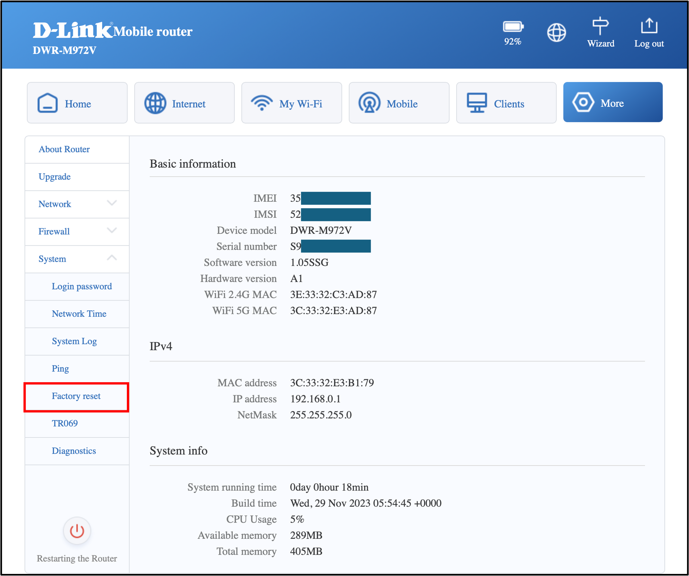

# CVE-2025-22968

D-Link DWR-M972V Software Version 1.05SSG Unauthenticated Access Vulnerability

## Description
Unauthenticated access in the default configuration of the D-Link DWR-M972V (Software Version 1.05SSG) allows an anonymous attacker to access the router and upload malicious backdoor scripts via public access.

## Vulnerability Type
Improper Authentication

## Vendor of Product
D-Link

## Affected Product Code Base
D-Link DWR-M972V Software Version 1.05SSG

## Affected Component
RouterOS on the router

## Attack Type
Remote

## Impact Code execution
True

## Impact Information Disclosure
True

## Attack Vectors
To exploit the vulnerability, the anonymous attacker could exploit.

## Discoverer
Chanon Temkamolsin, Weelapat Umarsa

## Proof of Concept

The tester navigates to the settings web GUI and performs a factory reset of the router before testing.

The tester connected the LAN cable from their device to the router and used "nmap" to scan the router's open ports. The scan revealed that the router had the following ports open: "22-SSH", "23-Telnet", and "443-HTTP".

The tester attempted to access the router via SSH and was able to log in as the `root` user without a password.

The tester attempted the same method on the WAN port and found that it allowed access to the router in the same way as the Local LAN port.

Additionally, the tester attempted to set a password for router authentication but discovered that it was not possible to configure a password for authentication on the router.
